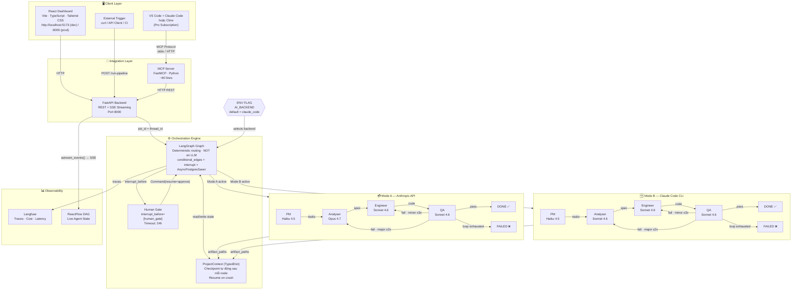
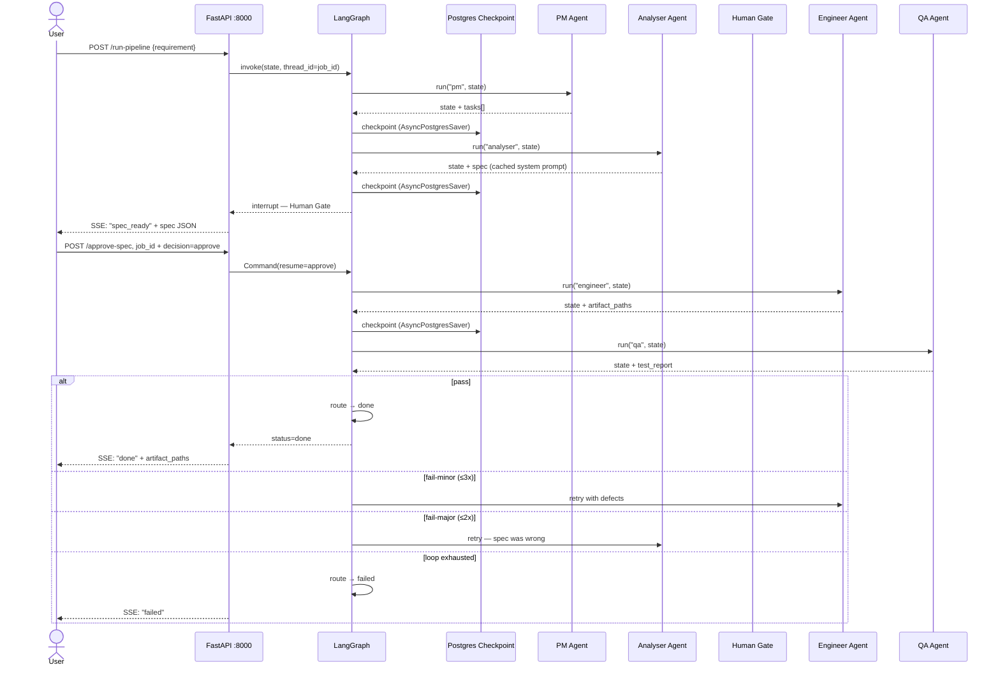
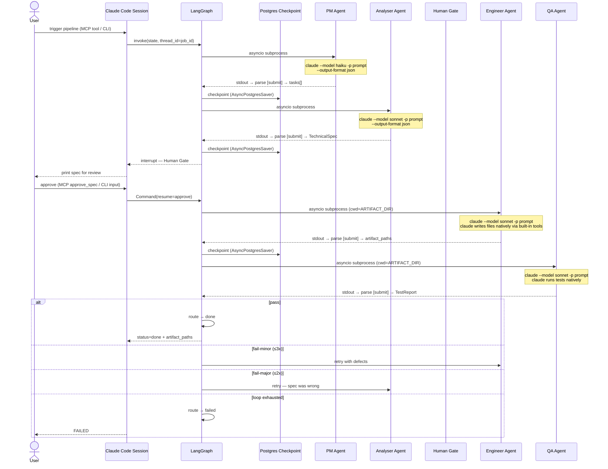

# SOLUTION — AI Orchestrator Architecture

> Tài liệu này tổng hợp các quyết định kiến trúc đã được chốt cho hệ thống AI Orchestrator.
> Mục đích: dùng để trình bày, onboard team, và làm reference khi implement.
> Cập nhật: 2026-05-15 | v5: UI/UX redesign (Jira/Linear dark theme) — 6 grouped tabs, Projects Browser, 54 UI tests pass, 69 backend tests pass, build clean

## Changelog

| Ngày | Thay đổi |
|---|---|
| 2026-05-16 (v5d) | **Senior hardening + QA suite expansion (61 tests)**. `claude_code_backend.py`: subprocess timeout (`AGENT_TIMEOUT_SECONDS`, default 300s), retry loop (1 retry + 5s backoff on transient failures), model-specific cost tracking (`_MODEL_COST_PER_1K_OUTPUT_TOKENS`), 80% budget soft-warning. `task_decompose.py`: DFS cycle detection (`_detect_cycle`) — parse_submit raises ValueError on cyclic dependency graphs. `graph.py`: `_drain_message_queue()` called from both `handle_done` and `handle_failed` to discard stale queue entries at terminal nodes. `tests/test_graph.py`: +20 new tests covering analyser spec_md regression, spec_analyze approval bypass (CRITICAL/HIGH), task cycle detection (4 cases), queue drain at terminal nodes, message queue draining per-agent. All 61 tests pass. Files: `orchestrator/backends/claude_code_backend.py`, `agents/task_decompose.py`, `orchestrator/graph.py`, `tests/test_graph.py`. |
| 2026-05-16 (v5c) | **Pre-release audit + docs sync**. CLAUDE.md rewritten to reflect actual 10-agent (8 SDLC + 2 SDD Speckit) + adaptive intent-based pipeline (query/test/review/bug_fix/feature). ProjectContext updated with pipeline_intent, SDD speckit fields, multi-point interaction fields. API Endpoints expanded to 15. MCP resources documented. Directory structure updated. FE UI corrected to Jira/Linear dark theme + 6 grouped tabs. Removed duplicate TypeScript interfaces in `frontend/src/types/index.ts` (lines 235-246). |
| 2026-05-15 (v5b) | **UI/UX Redesign — IMPLEMENTED**. Jira/Linear dark theme, 6 grouped tabs (Live/Plan/Spec/Code/Quality/Outcome), 2-column layout, PipelineBar, ClarificationModal/ApprovalModal sticky panels, Projects Browser in sidebar, archive view, welcome screen. 54 UI tests (all pass), frontend builds clean. |
| 2026-05-15 (v5) | **HTML Presentation Generator + Pipeline History — IMPLEMENTED**. Skill `/present` at `.claude/skills/present/SKILL.md`. Projects browser (BE + FE). Pipeline diagram bug fixed (row-reverse node order). 69 tests pass, frontend builds clean. See v5 design section below. |
| 2026-05-15 (v4) | **SDD Speckit — Full Implementation**. 2 new agents (SpecAnalyze, TaskDecompose), adaptive graph with intent routing, 5 new API endpoints (/inject /modify-spec /artifact /pause + updated /status), frontend SDD/Analysis/Inject tabs, 69 tests (all pass), frontend builds clean. See implementation section below. |
| 2026-05-15 (v3) | **SDD Speckit Integration + Adaptive Pipeline** — DESIGN. Intent-based routing, speckit methodology embedding, multi-point user interaction, constitutional governance. |
| 2026-05-15 (v2) | **Enhanced SDLC Pipeline + full senior audit** — 8-agent pipeline, CLAUDE.md/GUIDELINE.md rewritten, .env.example/.docker-compose updated for all 8 agents, api_backend.py fixed, bandit+pip-audit added to pyproject.toml, mcp_server updated with clarify tool + 4 new resources, api/main.py description fixed, agents/base.py comment fixed, 29 tests (all pass). |
| 2026-05-12 | **Hello Django sample project**: Created minimal Django 4.2+ "Hello World" app under `projects/hello_django/`. Files: `manage.py`, `requirements.txt`, `README.md`, `hello_django/` project package (settings, urls, wsgi, asgi), `hello/` app (views, urls, apps, models, tests, migrations). Single GET `/` view returning `HttpResponse('Hello, World!')` with 405 on all other methods. |
| 2026-05-11 | **Thống nhất 1 root**: Engineer/QA chạy từ `projects/<name>/` (không còn `artifacts/`). Xóa `_get_artifact_dir()`. UI redesign: 4 tabs (Tasks/Spec/Code/QA), SprintBoard, SpecReview cải tiến. WatchFiles fix (`python -m api.main`). Clear toàn bộ checkpoints cũ. |
| 2026-05-10 | **SQLite bị xóa hoàn toàn** — chỉ dùng `AsyncPostgresSaver` (PostgreSQL). Docker Compose stack. QA audit fixes (CORS, idempotency, secret filtering, null guards, SSE filter). Windows `claude.cmd` fix. |
| 2026-05-09 | Initial build — LangGraph + 4 agents + FastAPI + React + MCP Server |

---

## 2026-05-15 v5 — HTML Presentation Generator + Pipeline History (DESIGN)

### Feature 1: HTML Presentation Generator

#### Core Idea

Người dùng muốn chuyển đổi bất kỳ `.md` file nào thành một **HTML presentation đẹp theo phong cách SOLUTION.html** — dùng để trình bày cho khách hàng, với tiếng Việt, highlight rõ process/workflow/map/infrastructure. Đây là hai thứ riêng biệt nhưng phối hợp:

1. **Claude Code Skill `/present`** — user gọi trong terminal/VS Code để generate HTML từ file `.md` bất kỳ
2. **Pipeline Report Step (tùy chọn)** — sau Retrospective, tự động generate HTML report cho run đó
3. **Frontend Reports Panel** — hiển thị các file HTML đã generate, preview trực tiếp trong browser

---

#### Design: Claude Code Skill `/present`

**Vị trí**: `.claude/skills/present/SKILL.md`

**Frontmatter**:
```yaml
name: present
description: Convert a markdown file to a beautiful Vietnamese HTML presentation in SOLUTION.html style
argument-hint: <path-to-md-file>
user-invocable: true
disable-model-invocation: false
```

**Workflow của skill** (9 bước):

1. **Đọc file đầu vào**: Nhận `<path.md>` từ argument. Đọc toàn bộ nội dung.
2. **Phân tích cấu trúc**: Xác định heading levels (H1=section, H2=subsection, H3=detail), bảng, code blocks, mermaid diagrams, bullet lists.
3. **Xác định content type**: Process flow? Architecture map? API reference? Feature spec? Business requirements? — mỗi loại có layout riêng.
4. **Load HTML template**: Template embedded trong SKILL.md — CSS variables, card system, pipeline nodes, color palette từ SOLUTION.html.
5. **Map từng section vào component**:
   - H1 → Hero section với gradient background
   - H2 với table → Card với data grid
   - Mermaid diagram → SVG flow diagram (rendered inline)
   - Code block → Syntax-highlighted panel
   - Bullet list → Feature cards với icons
   - Table → Styled data table với hover
6. **Inject tiếng Việt context**: Translate technical terms, thêm giải thích cho customer-facing sections. Giữ nguyên technical jargon trong code blocks.
7. **Generate `<output-path>.html`**: Tên file = `<input-name>-presentation.html`. Lưu cùng thư mục hoặc `presentations/` nếu có.
8. **Quality check**: Kiểm tra HTML valid, tất cả sections có content, không có broken layout (empty containers).
9. **Report**: Thông báo file đã tạo, cung cấp đường dẫn, gợi ý `open <file>` command.

**Template sections embedded trong SKILL.md**:
```
- Hero banner (project name + tagline)
- Pipeline flow (horizontal nodes, supports up to 15 steps, snake layout for >8)
- Architecture diagram (card-based, color-coded by layer)
- Feature cards (3-column grid)
- Specification table (striped, sortable header)
- Code showcase (syntax highlight với line numbers)
- Metrics tiles (stat cards, large numbers)
- Timeline/changelog (vertical with bullets)
- Infrastructure map (layered boxes với connections)
- Q&A / FAQ section
- Vietnamese footer với contact + version
```

**Color palette** (consistent với SOLUTION.html):
```css
--primary: #6366f1   /* indigo */
--success: #10b981   /* emerald */
--warning: #f59e0b   /* amber */
--danger:  #ef4444   /* red */
--bg:      #0f172a   /* slate-900 */
--surface: #1e293b   /* slate-800 */
--text:    #e2e8f0   /* slate-200 */
```

---

#### Design: Pipeline Report Step (Optional)

**Khi nào chạy**: Sau Retrospective agent, nếu `GENERATE_HTML_REPORT=true` (env var).

**Implementation**: Thêm một node `report_generator` nhẹ (không phải full agent — dùng template rendering, không cần LLM):
```python
async def report_generator(state: ProjectContext) -> ProjectContext:
    """Generate HTML report from pipeline artifacts. No LLM call."""
    html = render_pipeline_report(state)  # template engine, not AI
    report_path = f"{state['project_dir']}/report.html"
    Path(report_path).write_text(html)
    artifact_paths = {**state["artifact_paths"], "report.html": report_path}
    return {"artifact_paths": artifact_paths}
```

**Template covers**:
- Pipeline intent + job_id + timestamp
- Agent timeline (which agents ran, duration, status)
- Tasks completed (from `tasks_md`)
- Spec summary (từ `spec_md`)
- Test results (từ `test_report`)
- Security findings (từ `security_report`)
- Deploy info (từ `deploy_report`)
- Retrospective lessons (từ `retrospective`)
- Vietnamese customer summary: "Hệ thống đã xây dựng gì, vì sao, kết quả ra sao"

**Routing**: Sau `report_generator` → `done` hoặc `failed` (không thay đổi outcome).

---

#### Design: Frontend Reports Panel

**Vị trí trong UI**: Tab mới "Reports" trong right panel, hoặc sidebar section "📊 Reports".

**Layout**:
```
Reports Panel
├── Run Report (current job)       → button "View HTML Report"
│   └── opens report.html in new tab via /artifact/{job_id}/report.html
├── SDD Artifacts
│   ├── spec.md                    → "📄 Spec" link
│   ├── plan.md                    → "🗺️ Plan" link
│   └── tasks.md                   → "📋 Tasks" link
└── Generated Presentations
    └── (files from /presentations/*.html) → inline iframe preview
```

**Inline preview**: `<iframe src="/artifact/{job_id}/report.html">` embedded trong tab, với toggle "Fullscreen" (opens in new tab).

---

#### New Files for Feature 1

| File | Action | Purpose |
|---|---|---|
| `.claude/skills/present/SKILL.md` | **NEW** | Skill definition + embedded HTML template |
| `.claude/skills/present/template.html` | **NEW** | Base HTML template (inlined into generated output) |
| `orchestrator/report_renderer.py` | **NEW** | Python Jinja2 template renderer for pipeline report |
| `templates/pipeline_report.html` | **NEW** | Jinja2 template for pipeline HTML report |
| `orchestrator/graph.py` | Update | Add optional `report_generator` node after retrospective |
| `api/routes.py` | Update | `/artifact/{job_id}/{filename}` already exists — verify it serves `.html` files |
| `frontend/src/App.tsx` | Update | Add "Reports" tab with iframe preview |
| `.env.example` | Update | `GENERATE_HTML_REPORT=false` |

---

---

### Feature 2: Pipeline History & Project Grouping

#### Core Idea

UI hiện tại không có history. User muốn:
- **Group các pipeline runs theo project** (nếu cùng project_dir → cùng project)
- **Xem lại mỗi run đã làm gì** (intent, tasks, status, artifacts)
- **Browse archive** của các project đã build

---

#### Data Model

**Project** = nhóm các runs có cùng `project_name` (basename của `project_dir`).

```python
class ProjectSummary(TypedDict):
    project_name: str          # basename của project_dir
    latest_run:   str          # job_id của run mới nhất
    run_count:    int
    last_updated: str          # ISO timestamp
    status:       str          # status của run mới nhất

class RunSummary(TypedDict):
    job_id:          str
    project_name:    str
    pipeline_intent: str       # "feature" | "bug_fix" | ...
    status:          str       # "done" | "failed" | "running"
    created_at:      str
    request_snippet: str       # first 100 chars của request
    task_count:      int
    has_report:      bool      # nếu report.html tồn tại
```

---

#### Data Source: PostgreSQL Checkpoints

LangGraph's `AsyncPostgresSaver` lưu state vào bảng `checkpoints`. Schema:

```sql
-- LangGraph internal tables (đã có sẵn)
checkpoints (thread_id, checkpoint_id, checkpoint, metadata, created_at)
checkpoint_writes (thread_id, ...)
```

**Query để list all runs**:
```python
async def list_all_runs(pool) -> list[RunSummary]:
    """Query LangGraph checkpoint table để get tất cả runs."""
    async with pool.acquire() as conn:
        rows = await conn.fetch("""
            SELECT DISTINCT ON (thread_id)
                thread_id,
                checkpoint->>'status' as status,
                checkpoint->'channel_values'->>'request' as request,
                checkpoint->'channel_values'->>'project_dir' as project_dir,
                checkpoint->'channel_values'->>'pipeline_intent' as intent,
                created_at
            FROM checkpoints
            ORDER BY thread_id, created_at DESC
        """)
    return [_row_to_run_summary(r) for r in rows]
```

**Project grouping**:
```python
def group_by_project(runs: list[RunSummary]) -> list[ProjectSummary]:
    from collections import defaultdict
    groups = defaultdict(list)
    for run in runs:
        groups[run["project_name"]].append(run)
    return [
        ProjectSummary(
            project_name=name,
            latest_run=max(runs, key=lambda r: r["created_at"])["job_id"],
            run_count=len(runs),
            last_updated=max(r["created_at"] for r in runs),
            status=next(r["status"] for r in sorted(runs, key=lambda r: r["created_at"], reverse=True)),
        )
        for name, runs in groups.items()
    ]
```

---

#### New API Endpoints

| Endpoint | Purpose |
|---|---|
| `GET /projects` | List all projects with run counts, latest status |
| `GET /projects/{project_name}/runs` | All runs for a specific project, newest first |
| `GET /projects/{project_name}/runs/{job_id}` | Full status snapshot of a specific run |

**`GET /projects` response**:
```json
{
  "projects": [
    {
      "project_name": "todo-api",
      "latest_run": "job-abc123",
      "run_count": 4,
      "last_updated": "2026-05-15T10:30:00Z",
      "status": "done"
    }
  ]
}
```

---

#### Frontend: Projects Browser

**Layout** (sidebar section, phía dưới PipelineForm):

```
┌─ Projects ─────────────────────┐
│  🗂 todo-api          4 runs   │
│  🗂 auth-service      2 runs   │
│  🗂 data-pipeline     1 run    │
└────────────────────────────────┘
```

Click vào project → expand accordion:
```
▼ 🗂 todo-api  (4 runs)
  ├── ✅ 2026-05-15  feature  "Build a TODO REST API with..."  [Load]
  ├── ✅ 2026-05-14  bug_fix  "Fix the pagination endpoint..."  [Load]
  ├── ❌ 2026-05-13  feature  "Add Redis caching..."  [Load]
  └── ✅ 2026-05-12  feature  "Initial todo API"  [Load]
```

Click **[Load]** → load state từ `/projects/{name}/runs/{job_id}` vào current view, read-only mode (không start lại pipeline).

**Read-only mode indicator**: Khi đang xem run cũ, header có badge "📚 Archive View" màu slate. Không show Submit / Cancel buttons. Show "Load Live" button để switch sang live polling nếu run vẫn còn active.

---

#### State Machine Update (`usePipeline.ts`)

```typescript
type PipelineView = "active" | "archive";

// New actions:
loadFromArchive(jobId: string): void  // load job state into view, set mode="archive"
browseProjects(): void                 // fetch /projects list
expandProject(name: string): void      // fetch /projects/{name}/runs
```

---

#### New Files for Feature 2

| File | Action | Purpose |
|---|---|---|
| `api/routes.py` | Update | `GET /projects`, `GET /projects/{name}/runs`, `GET /projects/{name}/runs/{job_id}` |
| `api/schemas.py` | Update | `ProjectSummary`, `RunSummary`, `ProjectListResponse`, `RunListResponse` |
| `api/project_store.py` | **NEW** | Query logic against LangGraph checkpoint table |
| `frontend/src/api/client.ts` | Update | `listProjects()`, `listProjectRuns(name)`, `getRunSnapshot(name, jobId)` |
| `frontend/src/types/index.ts` | Update | `ProjectSummary`, `RunSummary` interfaces |
| `frontend/src/hooks/useProjects.ts` | **NEW** | Fetch + cache projects list, auto-refresh every 30s |
| `frontend/src/components/ProjectsBrowser.tsx` | **NEW** | Accordion project list with run history |
| `frontend/src/App.tsx` | Update | Sidebar: add ProjectsBrowser below PipelineForm; add archive mode indicator |

---

#### Key Design Decisions (v5)

**1. Read from LangGraph checkpoint table directly (không dùng `_jobs` dict)**
`_jobs` là in-memory, mất khi restart. PostgreSQL checkpoint là source of truth, persist mãi. Query trực tiếp vào `checkpoints` table — không cần thêm bảng riêng.

**2. `/present` skill là standalone, không dependent vào pipeline**
Skill hoạt động độc lập — user có thể convert bất kỳ `.md` nào, không chỉ pipeline artifacts. Đây là utility skill dùng được cho toàn bộ project documentation.

**3. Pipeline Report là optional, không blocking**
`GENERATE_HTML_REPORT=false` by default. Khi enabled, lỗi trong report generation không block `done`/`failed` routing — catch exception, log warning, continue.

**4. Archive view là read-only hard stop**
Không cho phép resume/cancel từ archive view. User phải click "Go to Live" explicitly. Prevents accidental pipeline operations on old jobs.

**5. Project name derived từ project_dir, không phải user input**
`project_name = os.path.basename(project_dir)` khi project_dir set. Nếu project_dir là None (query/review intent), `project_name = "no-project"`. Groups sẽ tự động đúng mà không cần user đặt tên project manually.

---

#### Implementation Order (sau khi user approve design)

1. **Skill `/present`**: `.claude/skills/present/SKILL.md` + template (self-contained, no backend changes)
2. **Pipeline Report**: `report_renderer.py` + Jinja2 template + graph node (optional, env-gated)
3. **Frontend Reports tab**: iframe preview, artifact links (FE-only change)
4. **API Project endpoints**: `api/project_store.py` + new routes (BE-only change)
5. **Frontend Projects browser**: `ProjectsBrowser.tsx` + `useProjects.ts` + App.tsx integration

---

## 2026-05-15 v3 — SDD Speckit Integration + Adaptive Pipeline (DESIGN)

### Core Insight: Three Paradigm Shifts

**1. Pipeline intent is not always "build a feature"**

The user's key observation: not every request needs the full 8-agent flow. PM must classify intent and route accordingly. A question about the project should not spin up an Engineer. A test request should not generate a spec.

**2. Speckit commands are methodology, not a service**

Speckit's commands (`/speckit.specify`, `/speckit.plan`, etc.) are markdown prompt templates that encode *how* to think about each phase. We cannot `subprocess.call("speckit plan")`. Instead we embed speckit's exact methodology into each agent's system prompt and produce speckit-compatible output files (`specs/spec.md`, `specs/plan.md`, `specs/tasks.md`).

**3. User interaction is not a one-time gate**

Currently the user only interacts at two points: clarification gate and human gate. The user wants richer interaction: inject context mid-run, request spec revisions after any artifact, respond to agent questions in real time, not just approve/reject.

---

### Pipeline Intent Classification

PM's first job is to classify the request. This determines which graph path activates.

| Intent | Example Requests | Agents Activated | SDD? |
|---|---|---|---|
| `query` | "What does X do?", "How is Y implemented?", "Explain this error" | PM → Analyser (Q&A) | No |
| `test` | "Run tests on X", "Check if Y passes", "Validate the API" | PM → Analyser → QA | No |
| `bug_fix` | "Fix bug X", "This crashes when...", "Error in prod" | PM → Analyser → Engineer → QA → Retro | No |
| `feature` | "Build X", "Add Y feature", "Implement Z" | Full SDD pipeline with speckit | **Yes** |
| `review` | "Review the spec", "Code review for X", "Check security" | PM → Reviewer or Security | No |

**Routing rule**: Only `feature` intent triggers speckit. All other intents bypass speckit stages entirely.

---

### Adaptive Graph — Full Design

```
                    ┌─────────────────────────────────────────────────────────────────┐
                    │                        INTENT ROUTER                            │
User Request ──► PM ─┤                                                               │
                    │  query  ──────────────────────────────────► Analyser (Q&A) ──► DONE
                    │  test   ──────────────────────────────────► Analyser ──► QA ──► DONE
                    │  bug_fix ─────────────────────────────────► Analyser ──► [Gate] ──► Engineer ──► QA ──► Retro ──► DONE/FAIL
                    │  review  ─────────────────────────────────► Reviewer or Security ──► DONE
                    │  feature ──────────────────────────────────────────────────────►┐
                    └─────────────────────────────────────────────────────────────────┘
                                                                                      │
                    FEATURE MODE (Full SDD Speckit Flow)                              │
                    ◄─────────────────────────────────────────────────────────────────┘
                    │
                    ▼
              [Constitution] ──► (first run or per project)
                    │
                    ▼
             speckit_specify ──► specs/spec.md
                    │
                    ▼
           [speckit_clarify?] ◄──── User interaction: answer PM questions
                    │               (can inject answers multiple times)
                    ▼
             speckit_plan   ──► specs/plan.md + specs/data-model.md + specs/contracts/
                    │
                    ▼
            speckit_analyze ──► cross-artifact validation report
                    │           └── if CRITICAL findings → back to analyser_plan (max 2×)
                    ▼
         [HUMAN GATE] ◄──── User reviews full SDD artifacts:
                    │          spec.md, plan.md, contracts/, analysis report
                    │          Can request spec revisions here (new: /modify-spec endpoint)
                    │
                    ▼
            speckit_tasks  ──► specs/tasks.md (dependency graph, parallel markers)
                    │
                    ▼
         [INTERACTION GATE] ◄──── User can inject: "also add rate limiting to task 4"
                    │
                    ▼
         Engineer (implement) ──► guided by tasks.md constraints
                    │
                    ▼
              Code Reviewer
                    │
                    ▼
         Security Scanner
                    │
                    ▼
           QA (+ checklist) ──► validates against spec.md acceptance criteria + checklist
                    │
                    ▼
              Deploy & Smoke
                    │
                    ▼
            Retrospective  ──► DONE / FAILED
```

---

### Speckit Command → Agent Mapping

| Speckit Command | Produces | Our Agent | How |
|---|---|---|---|
| `/speckit.constitution` | `specs/constitution.md` — immutable project principles | PM (first run) | PM embeds constitution methodology, writes constitution.md to disk |
| `/speckit.specify` | `specs/spec.md` — structured requirements (WHAT/WHY, success criteria, testable) | PM | PM uses specify methodology: short name, tech-agnostic criteria, max 3 clarification Qs |
| `/speckit.clarify` | Appends clarification session to `specs/spec.md` | Clarification gate | User answers Qs → integrated atomically into spec.md; can run multiple times |
| `/speckit.plan` | `specs/plan.md`, `specs/data-model.md`, `specs/contracts/*.md` | Analyser | Analyser uses plan methodology: Phase 0 research → Phase 1 models/contracts |
| `/speckit.analyze` | Findings table (CRITICAL/HIGH/MEDIUM/LOW), coverage metrics | SpecAnalyze agent (new) | Reads spec.md + plan.md + tasks.md, five-pass validation, routes back if CRITICAL |
| `/speckit.tasks` | `specs/tasks.md` — dependency-ordered, [P] parallel markers, phase-based | TaskDecompose step (new) | Reads spec.md + plan.md, produces tasks.md; Engineer is constrained by it |
| `/speckit.implement` | Code artifacts, phase-by-phase execution | Engineer | Engineer reads tasks.md, implements TDD order: tests first, then impl per task |
| `/speckit.checklist` | `specs/checklists/*.md` — requirement quality items | QA | QA validates spec acceptance criteria quality + generates checklist before running tests |

---

### Multi-Point User Interaction Design

**Current**: User interacts only at two fixed points (clarification gate, human gate).

**New**: User can interact at any point via a message queue that gets injected into the next agent's context.

#### Interaction Points

| Point | When | What user can do |
|---|---|---|
| **Clarification gate** | After PM flags ambiguity | Answer PM's questions, provide domain context |
| **After specify** | PM outputs spec.md | Review requirements draft, add missing context |
| **After plan** | Analyser outputs plan.md | Review architecture, request changes before human gate |
| **Human gate** | Full SDD artifacts ready | Approve, reject, or **request spec revision** (new) |
| **After tasks** | tasks.md generated | Inject extra requirements, reorder priorities |
| **During run** | Any time | Inject context that gets queued for next agent |
| **After any agent** | Agent completes node | Send feedback that influences next agent |

#### New API Endpoints

| Endpoint | Purpose |
|---|---|
| `POST /inject/{job_id}` | Queue a user message for the next agent to receive as additional context |
| `POST /modify-spec/{job_id}` | Request spec revision (pauses pipeline at current point, routes back to speckit_specify or speckit_plan) |
| `GET /artifact/{job_id}/{filename}` | Read any SDD artifact file (spec.md, plan.md, tasks.md, constitution.md) |
| `POST /pause/{job_id}` | Request a pause after current node completes |

#### Interaction State in ProjectContext

```python
class UserMessage(TypedDict):
    timestamp: str
    content: str
    injected_at: str   # which node consumed this message

# New ProjectContext fields:
pipeline_intent:      str         # "query"|"test"|"bug_fix"|"feature"|"review"
constitution:         str         # constitution.md content (immutable principles)
spec_md:              str         # specs/spec.md content (speckit specify output)
plan_md:              str         # specs/plan.md content (speckit plan output)
tasks_md:             str         # specs/tasks.md content (speckit tasks output)
spec_analysis:        Optional[SpecAnalysis]  # speckit analyze output
spec_checklist:       list[str]   # speckit checklist items
user_message_queue:   list[UserMessage]  # messages waiting to be consumed
interaction_log:      list[UserMessage]  # all consumed messages (audit trail)
pause_requested:      bool        # user requested pause after current node
spec_revision_count:  int         # how many times spec was revised (max 3)
```

---

### New ProjectContext Fields (Full List)

```python
# Intent & routing
pipeline_intent:      str              # "query"|"test"|"bug_fix"|"feature"|"review"
skip_nodes:           list[str]        # nodes to skip based on intent

# SDD artifacts (feature mode only)
constitution:         str              # specs/constitution.md content
spec_md:              str              # specs/spec.md (speckit specify)
plan_md:              str              # specs/plan.md (speckit plan)  
tasks_md:             str              # specs/tasks.md (speckit tasks)
spec_analysis:        Optional[dict]  # speckit analyze findings
spec_checklist:       list[str]        # speckit checklist items

# Multi-point interaction
user_message_queue:   list[dict]       # messages queued but not yet consumed
interaction_log:      list[dict]       # all consumed messages
pause_requested:      bool             # pause after current node
spec_revision_count:  int              # times spec.md was revised

# Already exists — unchanged
definition_of_done, needs_clarification, clarification_questions, clarification_context
code_review_report, security_report, deploy_report, retrospective
```

---

### New Graph Nodes

| Node | Replaces/Extends | Activates When |
|---|---|---|
| `pm_classify` | New — runs first inside PM | Always |
| `speckit_specify` | New — PM speckit specify phase | `intent == "feature"` |
| `speckit_plan` | Replaces `analyser` in feature mode | `intent == "feature"` |
| `spec_analyze` | New — between plan and human gate | `intent == "feature"` |
| `speckit_tasks` | New — after human gate, before engineer | `intent == "feature"` |
| `interaction_gate` | New — before engineer | `intent == "feature"` |
| `analyser_qa` | New — lightweight Q&A mode | `intent == "query"` |

---

### New Routing Functions

```python
def route_pm(state) -> str:
    intent = state["pipeline_intent"]
    if intent == "query":    return "analyser_qa"
    if intent == "test":     return "analyser"        # existing analyser → QA
    if intent == "bug_fix":  return "analyser"        # existing analyser → engineer → QA
    if intent == "review":   return "reviewer"
    if intent == "feature":
        if state.get("needs_clarification"): return "clarification_gate"
        return "speckit_specify"

def route_after_plan(state) -> str:
    # SpecAnalyze: if CRITICAL findings → back to plan (max 2x)
    analysis = state.get("spec_analysis", {})
    critical = [f for f in analysis.get("findings", []) if f.get("severity") == "CRITICAL"]
    if critical and state.get("spec_revision_count", 0) < 2:
        return "speckit_plan"   # re-plan
    return "human_gate"

def route_after_analyser_intent(state) -> str:
    intent = state["pipeline_intent"]
    if intent == "query":    return "done"
    if intent == "test":     return "qa"
    if intent == "bug_fix":  return "human_gate"
    if intent == "feature":  return "spec_analyze"
```

---

### UI Changes Required

| Component | Change |
|---|---|
| **Header** | Show intent badge (🔍 Query / 🧪 Test / 🐛 Fix / ✨ Feature / 🔎 Review) |
| **Step bar** | Adaptive — only show relevant steps for active intent |
| **SDD Artifacts panel** | New tab group: Spec / Plan / Tasks / Constitution (shown only for feature mode) |
| **Interaction panel** | Persistent input at bottom — user can type at any time; shows as "pending injection" if agent is busy |
| **Task board** | Enhanced — shows tasks.md format with phase headers, [P] parallel markers, dependency links |
| **Spec editor** | After spec.md is generated, user can view and request revision (not inline edit) |
| **Checklist panel** | QA tab shows speckit checklist items with pass/fail status |

---

### Files to be Created/Modified

| File | Action | Purpose |
|---|---|---|
| `orchestrator/context.py` | Update | New fields: pipeline_intent, spec_md, plan_md, tasks_md, spec_analysis, user_message_queue, etc. |
| `orchestrator/graph.py` | Major update | New nodes, new routing, adaptive edges |
| `orchestrator/runner.py` | Update | New initial state fields |
| `agents/pm.py` | Update | Intent classification + speckit_specify methodology |
| `agents/analyser.py` | Update | speckit_plan methodology (two modes: feature plan vs analyser QA/test) |
| `agents/spec_analyze.py` | **NEW** | speckit_analyze five-pass validation |
| `agents/task_decompose.py` | **NEW** | speckit_tasks dependency-ordered breakdown |
| `api/schemas.py` | Update | New request/response types |
| `api/routes.py` | Update | `/inject/{job_id}`, `/modify-spec/{job_id}`, `/artifact/{job_id}/{filename}`, `/pause/{job_id}` |
| `frontend/src/types/index.ts` | Update | New PipelineIntent type, new fields |
| `frontend/src/api/client.ts` | Update | New endpoint wrappers |
| `frontend/src/hooks/usePipeline.ts` | Update | Inject, pause, modify-spec actions |
| `frontend/src/App.tsx` | Major update | Adaptive step bar, SDD panels, interaction input |
| `.env.example` | Update | New intent-related env vars if any |
| `tests/test_graph.py` | Update | Tests for new routing functions and intent modes |
| `GUIDELINE.md` | Update | Document new intent modes, interaction model, speckit flow |

---

### Key Design Decisions

**1. Speckit as embedded methodology, not external service**
We do NOT call `specify` CLI. Instead we read the template files' methodology and embed the instructions into agent system prompts. Agents produce speckit-compatible output files. The result: users get speckit-format artifacts they can use in VS Code later.

**2. Single graph, adaptive routing**
We don't build separate graphs per intent. One StateGraph with conditional edges. `route_pm` decides the path. Unused nodes are simply skipped. This preserves LangGraph's checkpoint/resume semantics.

**3. User message queue, not streaming injection**
True mid-stream injection into a running subprocess is complex. Instead: user messages are queued to `user_message_queue` via `POST /inject`. When the next node starts, it drains the queue and prepends messages to its context. This is safe, atomic, and LangGraph-checkpointable.

**4. Spec revision via re-routing, not inline edit**
When user requests spec revision, `POST /modify-spec` adds a revision request to the queue + sets `pause_requested=True`. After current node completes, graph routes back to `speckit_specify` or `speckit_plan` (controlled by `spec_revision_count` to prevent infinite loops, max 3).

**5. Constitution is per-project, persisted to disk**
`specs/constitution.md` is written once. On subsequent runs for the same project, PM reads the existing constitution and uses it as hard constraints. This is the "immutable" property speckit guarantees.

---

### What is NOT in scope (deliberately excluded)

- True streaming mid-process injection (too complex for Mode B subprocess)
- Parallel task execution by Engineer (tasks.md marks them [P] but sequential execution safer for Mode B)
- Speckit extension system (we use core commands only)
- `/speckit.taskstoissues` (GitHub Issues integration — separate concern)
- Full speckit CLI installation (we embed methodology; CLI optional for human use)

---

### 2026-05-15 — Enhanced SDLC Pipeline (Senior PM SDLC Audit)

**Motivation**: Gap analysis vs real SDLC identified 6 missing stages: clarification loop, formal Definition of Done, code review, security scan, deployment verification, retrospective. Inspired by Paperclip framework patterns (budget guard, org chart, goal alignment).

**New agent pipeline**:
```
PM → [clarification_gate?] → Analyser → [human_gate] → Engineer → Reviewer → Security → QA → Deploy → Retrospective → DONE/FAILED
```

**Files changed**:
| File | Change |
|---|---|
| `orchestrator/context.py` | +4 TypedDicts: `CodeReviewReport`, `SecurityReport`, `DeployReport`, `Retrospective`. +8 `ProjectContext` fields: `definition_of_done`, `needs_clarification`, `clarification_questions`, `clarification_context`, `code_review_report`, `security_report`, `deploy_report`, `retrospective` |
| `agents/pm.py` | Outputs `definition_of_done[]` and `needs_clarification` flag with `clarification_questions[]` |
| `agents/reviewer.py` | NEW — text-only code review agent; reads spec + artifact_paths; outputs `{status: pass\|fail, issues, summary}` |
| `agents/security.py` | NEW — shell agent runs bandit + pip-audit; outputs `{status: pass\|warn\|fail, vulnerabilities, summary}`. `warn` = pass-through (minor findings don't block) |
| `agents/deploy.py` | NEW — shell agent detects framework, installs deps, starts server on port 9000, smoke tests with curl; outputs `{status: pass\|fail, endpoint, response, command_used}` |
| `agents/retrospective.py` | NEW — text-only, analyzes full history + all reports; outputs lessons learned regardless of pass/fail |
| `agents/__init__.py` | Registered 4 new agents in `AGENTS` dict |
| `orchestrator/backends/claude_code_backend.py` | `_SHELL_AGENTS` (engineer/qa/security/deploy get `--dangerously-skip-permissions`), `_TEXT_ONLY_AGENTS` (pm/analyser/reviewer/retrospective get `--tools ""`). Budget guard: raises `RuntimeError` if tokens > `MAX_TOKENS_PER_AGENT`. SUBMIT_INSTRUCTIONS for all 4 new agents. |
| `orchestrator/graph.py` | Complete rewrite. New nodes: `clarification_gate`, `reviewer`, `security`, `deploy`, `retrospective`. New routing: `route_pm`, `route_reviewer`, `route_security`, `route_qa`, `route_retrospective`. All failure paths route through retrospective before terminal nodes. |
| `orchestrator/runner.py` | `_initial_state` includes all 8 new fields. `resume_pipeline` handles `clarification_gate` in `next_nodes`. |
| `api/schemas.py` | `ClarifyRequest`, `ClarifyResponse`. `JobStatusResponse` has all new optional fields. |
| `api/routes.py` | `POST /clarify/{job_id}` endpoint. `/status` returns `waiting_clarification` status. |
| `frontend/src/types/index.ts` | `"waiting_clarification"` added to `PipelineStatus`. 4 new interfaces. `JobStatusResponse` updated. |
| `frontend/src/api/client.ts` | `clarify(jobId, clarificationContext)` → `POST /clarify/{jobId}` |
| `frontend/src/hooks/usePipeline.ts` | `clarify` action. `"waiting_clarification"` in `TERMINAL_STATUSES`. Auto-discover prefers clarification state. |
| `frontend/src/App.tsx` | Complete rewrite. 10-step flow bar. `ClarificationBanner` panel. 8 tabs: tasks/spec/review/security/code/qa/deploy/retro. `CodeReviewPanel`, `SecurityPanel`, `DeployPanel`, `RetroPanel`. Auto tab-switching. |
| `frontend/src/components/StatusBadge.tsx` | `waiting_clarification` entry (purple pill). |
| `frontend/src/components/AgentTimeline.tsx` | Colors for reviewer (yellow), security (red), deploy (teal), retrospective (indigo). |

**Paperclip-inspired additions**:
- **Budget guard** (`MAX_TOKENS_PER_AGENT` env var) — prevents runaway token usage per agent turn
- **Formal DoD** — PM outputs `definition_of_done[]` that flows through the entire pipeline as acceptance criteria
- **Clarification loop** — PM asks questions before Analyser starts; user answers via UI or MCP; graph pauses via in-node `interrupt()`
- **Goal alignment** — DoD is passed in context to all agents so they work toward the same criteria

**New env vars**:
- `MAX_TOKENS_PER_AGENT` — optional integer; raises error if any agent exceeds this token count per invocation

---

## System Architecture Map



---

## 1. Tổng quan hệ thống

| Thành phần | Mô tả |
|---|---|
| **Tên hệ thống** | AI Orchestrator |
| **Mục tiêu** | Tự động hóa quy trình phát triển phần mềm qua 4 AI agents chuyên biệt |
| **Pattern kiến trúc** | LangGraph (deterministic graph, routing KHÔNG phải LLM) |
| **Tích hợp IDE** | MCP Server Bridge → VS Code (Claude Code hoặc Cline) |
| **UI** | React 18 + Vite + TypeScript + Tailwind CSS — sidebar layout, SSE real-time timeline, spec review, QA report |
| **Ngôn ngữ** | Python (backend + MCP) · TypeScript/React (frontend) |
| **Methodology** | SDD — Specification-Driven Development |

### Definition of Done — KPIs

| Metric | Target |
|---|---|
| QA pass rate lần đầu (first-pass) | ≥ 60% |
| Latency full pipeline run | < 5 phút (Mode A, project nhỏ) |
| Cost per run (Mode A) | < $0.20 với caching |
| Resume thành công sau crash | 100% — checkpoint sau mỗi node |
| Human Gate response time | Tối đa 24h trước khi auto-expire |

---

## 2. Pipeline Flow — Theo Từng Mode

### Mode A — Anthropic API (Pay-per-token)

> Chạy fully automated, không cần session mở. Dùng cho production / CI-CD.



**Sequence Table — Mode A**

| # | Actor | Action | Model | Input | Output |
|---|---|---|---|---|---|
| 1 | User | POST /run-pipeline | — | Requirement text | job_id |
| 2 | FastAPI | invoke LangGraph | — | state{request, job_id} | stream |
| 3 | PM Agent | API call | Haiku 4.5 | Requirement + submit instruction | tasks[] |
| 4 | LangGraph | checkpoint | — | state + tasks | Postgres row |
| 5 | Analyser Agent | API call (cached) | Opus 4.7 | Tasks + submit instruction | TechnicalSpec |
| 6 | LangGraph | checkpoint + interrupt | — | state + spec | pause at human_gate |
| 7 | FastAPI | SSE notify | — | spec JSON | "spec_ready" event |
| 8 | User | POST /approve_spec | — | job_id + "approve" | — |
| 9 | Engineer Agent | API call | Sonnet 4.6 | Spec + tasks + submit instruction | artifact_paths + files on disk |
| 10 | LangGraph | checkpoint | — | state + artifact_paths | Postgres row |
| 11 | QA Agent | API call | Sonnet 4.6 | Spec + artifact_paths + submit instruction | TestReport |
| 12 | route_qa | Python function | — | test_report.status | "done" / "engineer" / "analyser" / "failed" |
| 13 | FastAPI | SSE notify | — | final status | "done" hoặc "failed" |

---

### Mode B — Claude Code (Pro subscription, no API key)

> Cần Claude Code session mở. Dùng cho dev / prototype. Mọi agent dùng Sonnet 4.6 (Opus không có).



**Sequence Table — Mode B**

| # | Actor | Action | Model | Input | Output |
|---|---|---|---|---|---|
| 1 | User | trigger via MCP / CLI | — | Requirement text | job_id |
| 2 | LangGraph | invoke | — | state{request, job_id} | start graph |
| 3 | ClaudeCodeBackend | `claude -p` subprocess | Haiku 4.5 | Full prompt + submit instruction | stdout JSON envelope |
| 4 | parse_submit | regex `<submit>` | — | stdout text | tasks[] |
| 5 | LangGraph | checkpoint | — | state + tasks | Postgres row |
| 6 | ClaudeCodeBackend | `claude -p` subprocess | Sonnet 4.6 | Full prompt (tasks + spec instruction) | stdout JSON envelope |
| 7 | parse_submit | regex `<submit>` | — | stdout text | TechnicalSpec |
| 8 | LangGraph | checkpoint + interrupt | — | state + spec | pause at human_gate |
| 9 | User | review spec + approve | — | spec text | "approve" |
| 10 | LangGraph | Command(resume) | — | "approve" | resume graph |
| 11 | ClaudeCodeBackend | `claude -p` subprocess (cwd=ARTIFACT_DIR) | Sonnet 4.6 | Full prompt (spec + engineer instruction) | files written to disk + stdout |
| 12 | parse_submit | regex `<submit>` | — | stdout text | artifact_paths |
| 13 | LangGraph | checkpoint | — | state + artifact_paths | Postgres row |
| 14 | ClaudeCodeBackend | `claude -p` subprocess (cwd=ARTIFACT_DIR) | Sonnet 4.6 | Full prompt (spec + artifacts + QA instruction) | test results + stdout |
| 15 | parse_submit | regex `<submit>` | — | stdout text | TestReport |
| 16 | route_qa | Python function | — | test_report.status | "done" / "engineer" / "analyser" / "failed" |

---

**So sánh trực tiếp 2 modes:**

| | Mode A (API) | Mode B (Claude Code) |
|---|---|---|
| **Auth** | `ANTHROPIC_API_KEY` | Pro subscription session |
| **PM model** | Haiku 4.5 | Haiku 4.5 |
| **Analyser model** | Opus 4.7 | Sonnet 4.6 |
| **Engineer model** | Sonnet 4.6 | Sonnet 4.6 |
| **QA model** | Sonnet 4.6 | Sonnet 4.6 |
| **Cost/run** | ~$0.09–0.18 | $0 thêm |
| **Cần session** | Không | Có |
| **File writing** | SDK tool calls | claude CLI built-in |
| **Submit protocol** | Formal tool call | `<submit>` JSON block |
| **Checkpoint** | Sau mỗi API call | Sau mỗi subprocess |
| **Background** | Có | Không |

---

## 3. Các Agent trong hệ thống

| Agent | Vai trò | Input | Output | Model (Mode A) |
|---|---|---|---|---|
| **PM** | Phân tích yêu cầu, tạo task list có độ ưu tiên | User requirement | Structured task list | Haiku 4.5 |
| **Senior Analyser** | Viết technical spec, data/API contracts, risk analysis | Task list | TechnicalSpec (SDD format) | Opus 4.7 |
| **Senior Engineer** | Implement code theo spec | TechnicalSpec + Tasks | Code files (lưu vào ARTIFACT_DIR) | Sonnet 4.6 |
| **Senior QA** | Validate code theo spec, run tests, báo cáo defects | Artifact paths + Spec | TestReport (pass/fail-minor/fail-major) | Sonnet 4.6 |

### Luồng Pipeline

```
User Requirement
      ↓
[PM Agent]           → tạo danh sách tasks có độ ưu tiên
      ↓
[Analyser Agent]     → viết technical spec theo SDD format
      ↓
[Human Gate]         ← bạn review và approve spec (timeout: 24h)
      ↓
[Engineer Agent]     → implement code, lưu vào ARTIFACT_DIR
      ↓
[QA Agent]           → chạy tests, validate theo spec
      ↓
  PASS                → DONE ✅
  FAIL (minor, ≤3x)   → quay lại Engineer
  FAIL (major, ≤2x)   → quay lại Analyser
  Loop exhausted      → FAILED ❌ (không silent-succeed)
```

> **Tại sao có FAILED state riêng?** Nếu dùng `END` khi hết iteration, system kết thúc nhưng không phân biệt được "thành công" hay "thất bại". FAILED state được surface rõ ở API response, UI, và Langfuse trace.

---

## 3. Dual-Mode Strategy

Hệ thống hỗ trợ 2 modes, chuyển đổi bằng một ENV variable — không cần thay code.

| | **Mode A (Default — MVP)** | **Mode B (Phase 2+)** |
|---|---|---|
| **ENV** | `AI_BACKEND=api` | `AI_BACKEND=claude_code` |
| **LLM Brain** | Anthropic API direct calls | Claude Code sub-agents (Agent SDK) |
| **Chi phí LLM** | ~$0.09–0.18/pipeline run | $0 thêm — covered bởi Pro subscription |
| **Cần API credit** | Có | Không |
| **Chạy 24/7 background** | Có — fully automated | Không — cần Claude Code session mở |
| **Trigger từ ngoài** | Có — POST /run-pipeline | Không (session-based) |
| **Phù hợp** | MVP · Production · CI/CD · Enterprise | Dev cá nhân · tiết kiệm cost |
| **Tương thích LangGraph** | Đầy đủ — `invoke()` trả về state | Cần adapter layer |

> **MVP path:** Ship Mode A trước — fully automated, testable, CI/CD-ready. Mode B là cost optimization, thêm vào Phase 2 sau khi Mode A ổn định. Mode B cần adapter layer để Claude Code sub-agent fit vào LangGraph `invoke()` interface.
>
> **Cách switch:** Chỉ cần đổi `AI_BACKEND` trong file `.env`, restart service. Toàn bộ LangGraph graph, MCP Server, UI không thay đổi.

---

## 4. Technology Stack

### Backend

| Layer | Công nghệ | Lý do chọn |
|---|---|---|
| **Runtime** | Python 3.11+ | Async support, AI/ML ecosystem |
| **API Framework** | FastAPI | Async native, auto OpenAPI docs, SSE support |
| **Orchestration** | **LangGraph** | Built-in interrupt/checkpoint/resume, deterministic routing |
| **Agent Framework** | Anthropic Agent SDK | Native Claude, MCP native, sub-agents |
| **MCP Server** | FastMCP (Python) | ~60 dòng code, auto Pydantic schema |
| **Checkpoint** | `AsyncPostgresSaver` | Dùng cho cả dev và prod — SQLite đã bị xóa. Package: `langgraph-checkpoint-postgres>=2.0` |
| **Container** | Docker + Docker Compose | Multi-stage build (Node→Python), Postgres 16-alpine |
| **Artifact Storage** | Local filesystem (dev) → S3 (prod) | Không embed content trong checkpoint |
| **Observability** | Langfuse (open-source, self-hosted) | Traces, cost, latency per agent |

### Frontend

| Layer | Công nghệ | Lý do chọn |
|---|---|---|
| **Framework** | React + TypeScript | Ecosystem, type safety |
| **DAG Visualization** | ReactFlow | MIT, 148k stars, custom nodes |
| **Real-time** | SSE consumer (EventSource API) | Stream LangGraph events live |
| **Styling** | Tailwind CSS | Rapid UI development |
| **State Management** | Zustand | Lightweight, phù hợp agent state |
| **Monitoring Dashboard** | Langfuse UI (self-hosted) | Embedded hoặc link out |

### Models (Mode A — Anthropic API)

| Agent | Model | Lý do |
|---|---|---|
| PM | `claude-haiku-4-5-20251001` | Task đơn giản, chi phí thấp nhất |
| Analyser | `claude-opus-4-7` | Cần reasoning sâu nhất, spec phức tạp |
| Engineer | `claude-sonnet-4-6` | Balance giữa quality và cost |
| QA | `claude-sonnet-4-6` | Balance — validation không cần Opus |

---

## 5. MCP Server — VS Code Integration

MCP Server là cầu nối để VS Code (Claude Code hoặc Cline) tương tác với Orchestrator backend.

| Primitive | Tên | Mô tả |
|---|---|---|
| **Tool** | `run_pipeline` | Trigger pipeline — trả về `job_id` |
| **Tool** | `get_job_status` | Lấy trạng thái hiện tại của job |
| **Tool** | `approve_spec` | Approve/reject spec tại Human Gate (resume LangGraph) |
| **Tool** | `cancel_job` | Hủy một pipeline đang chạy |
| **Resource** | `project_spec/{job_id}` | Đọc TechnicalSpec của job |
| **Resource** | `test_report/{job_id}` | Đọc kết quả QA |
| **Resource** | `agent_logs/{job_id}` | Đọc log chi tiết từng agent |
| **Prompt** | `/build-feature` | Template: "Build feature X with spec Y" |
| **Prompt** | `/review-spec` | Template: "Review spec trước khi approve" |
| **Prompt** | `/run-qa` | Template: "Chạy QA cho artifacts hiện tại" |

> **job_id = thread_id:** `run_pipeline` tạo ra `job_id` (UUID), pass làm `thread_id` vào LangGraph config. Mọi API call sau đó (`get_job_status`, `approve_spec`) đều dùng `job_id` này để lookup đúng checkpoint.

> **Client support:** Cả **Claude Code** (Anthropic) và **Cline** (open-source, 61k stars) đều support MCP native.

---

## 6. Frontend UI — State Tracking Dashboard

### Layout dashboard

```
┌─────────────────────────────────────────────────────────────┐
│  Job: "Build REST API for auth"          Status: ENGINEERING │
│  Run #3   Started: 14:32   Cost: $0.09  Iteration: 1/3      │
├──────────────────────────┬──────────────────────────────────┤
│                          │                                  │
│   Pipeline DAG           │   Live Agent Log                │
│   (ReactFlow)            │   (SSE Stream)                  │
│                          │                                  │
│  [PM ✅] → [Analyser ✅] │  > Engineer: Reading spec...    │
│    → [Engineer 🔄]       │  > Writing auth/models.py       │
│    → [QA ⏳]             │  > Writing auth/routes.py       │
│                          │  > Running tests...             │
├──────────────────────────┴──────────────────────────────────┤
│  Human Gate: Spec ready for review    [Approve] [Reject]    │
│  Auto-expire in: 23h 42m                                    │
├─────────────────────────────────────────────────────────────┤
│  Token Usage: PM 1.2k | Analyser 8.4k | Engineer 14.1k     │
│  Cost: $0.00  |  $0.06  |  $0.04  |  Total: ~$0.10         │
└─────────────────────────────────────────────────────────────┘
```

### Tại sao không dùng Langflow/Flowise?

| | Langflow / Flowise | Custom React + ReactFlow |
|---|---|---|
| **Setup time** | Nhanh hơn | Lâu hơn |
| **Customize** | Hạn chế (opinionated platform) | Full control |
| **Tích hợp LangGraph** | Partial — platform có graph riêng | Seamless — consume SSE trực tiếp |
| **Production** | Tốt nếu dùng platform đó | Tốt hơn cho custom backend |
| **Quyết định** | ❌ | ✅ **Chọn cái này** |

---

## 7. Ecosystem Tools

### SDD — Specification-Driven Development

| | |
|---|---|
| **Là gì** | Methodology: spec là artifact chính, code là output từ spec |
| **Áp dụng** | Analyser viết spec → Engineer code theo spec → QA validate theo spec |
| **Tool hỗ trợ** | GitHub Spec Kit (93k stars), Kiro (AWS IDE) |
| **Lợi ích** | QA có tiêu chí rõ ràng, không phụ thuộc LLM "đoán" kết quả |

### Cline vs Claude Code

| | **Claude Code** | **Cline** |
|---|---|---|
| **Nhà phát triển** | Anthropic (chính thức) | Community open-source |
| **Chi phí** | Pro subscription | Free (Apache 2.0) |
| **LLM** | Claude only | 30+ providers |
| **MCP** | ✅ Native | ✅ Native |
| **Quyết định** | Primary client | Alternative nếu muốn open-source |

### Paperclip

| | |
|---|---|
| **Là gì** | Framework orchestrate AI agents như một "tổ chức" (org chart, budget, heartbeat) |
| **Stars** | 63,700+ (ra mắt 3/2026) |
| **Stack** | Node.js + TypeScript + React |
| **Heartbeat Pattern** | Agents "ngủ/thức" theo schedule, nhận context mới mỗi lần thức |
| **Quyết định** | Theo dõi — không dùng (Node.js, Python stack không match) |

---

## 8. Giới hạn & Rủi ro

| Rủi ro | Mức độ | Giải pháp |
|---|---|---|
| QA→Engineer loop vô tận | Cao | `MAX_QA_ITERATIONS=3` hard cap → FAILED state |
| QA→Analyser loop vô tận | Cao | `MAX_QA_ANALYSER_ITERATIONS=2` hard cap → FAILED state |
| Human Gate không có người approve | Cao | Auto-expire sau `HUMAN_GATE_TIMEOUT_HOURS=24`, job → FAILED |
| Prompt injection qua MCP | Cao | Sanitize input, whitelist actions trước khi forward |
| Silent failure (hết iteration nhưng báo DONE) | Cao | FAILED terminal state riêng, không dùng END |
| Cost vượt ngân sách (Mode A) | Trung bình | Token budget per agent, alert khi vượt ngưỡng |
| Agent timeout / crash giữa chừng | Trung bình | LangGraph tự checkpoint sau mỗi node — resume tự động |
| Artifact quá lớn làm bloat checkpoint | Trung bình | Lưu file vào `ARTIFACT_DIR`, chỉ store path trong state |
| Job registry (`_jobs`) mất khi restart server | Trung bình | LangGraph state trong Postgres vẫn OK — fix: persist `_jobs` vào DB |
| Mode B throttle (Pro subscription limit) | Thấp | Monitor usage, switch sang Mode A |
| Concurrent jobs dùng chung thread_id | Thấp | Luôn generate UUID cho mỗi job, pass làm `thread_id` |

---

## 9. Phân tích Chi phí

### Mode A (Anthropic API) — MVP & Production

```
Ước tính chi phí 1 pipeline run:
  PM        (Haiku 4.5):  ~2K tokens  → ~$0.001
  Analyser  (Opus 4.7):   ~8K tokens  → ~$0.120
  Engineer  (Sonnet 4.6): ~15K tokens → ~$0.045
  QA        (Sonnet 4.6): ~5K tokens  → ~$0.015
  ─────────────────────────────────────────────
  Tổng:                   ~30K tokens → ~$0.18/run

Với prompt caching (system prompt + spec cached):
  Tiết kiệm ~60-70% phần Analyser → ~$0.09-0.12/run

Ước tính tháng (50 runs): ~$5-9/tháng
```

### Mode B (Claude Code Pro) — Cost Optimization (Phase 2+)

```
Chi phí: $20/tháng flat
Phù hợp: Dev cá nhân, prototype
Giới hạn: Cần session mở, không chạy background 24/7
          Cần adapter layer để fit LangGraph invoke() interface
```

### Artifact Storage

```
Dev:  Local filesystem (ARTIFACT_DIR=./artifacts) — free
Prod: S3 Standard — ~$0.023/GB/tháng
      Với project ~500KB code: < $0.001/run
```

---

## 10. Roadmap Implementation

### MVP — Mode A (Tuần 1–8)

| Phase | Thời gian | Nội dung | Milestone |
|---|---|---|---|
| **Phase 1 — Foundation** | Tuần 1–2 | ProjectContext TypedDict + LangGraph graph + BaseAgent + Mock agents | Pipeline chạy end-to-end với mock, checkpoint/resume hoạt động |
| **Phase 2 — PM + API** | Tuần 3–4 | PM Agent thật + FastAPI backend + SSE streaming | Trigger từ API, xem log real-time, Human Gate endpoint |
| **Phase 3 — Full Pipeline** | Tuần 5–6 | Analyser + Engineer + QA agents | 4 agents chạy hoàn chỉnh, QA feedback loop, FAILED state |
| **Phase 4 — MCP + IDE** | Tuần 7–8 | MCP Server + VS Code integration | Trigger từ VS Code chat, approve spec từ IDE |

### Enhancement (Tuần 9–14)

| Phase | Thời gian | Nội dung | Milestone |
|---|---|---|---|
| **Phase 5 — UI** | Tuần 9–10 | React Dashboard + ReactFlow DAG + Langfuse | Full state tracking, cost dashboard |
| **Phase 6 — Mode B** | Tuần 11–12 | Claude Code sub-agent adapter + LangGraph bridge | Mode B hoạt động, switch bằng ENV |
| **Phase 7 — Production** ✅ | Tuần 13–14 | Docker + AsyncPostgresSaver + CORS + secret filtering + QA audit | Done 2026-05-10 |

### Build Order (phải theo thứ tự — mỗi bước validate bước trước)

```
1.  ProjectContext TypedDict (LangGraph state schema) + Task/Spec/TestReport models
2.  BaseAgent interface — Mode A skeleton (invoke, system_prompt, tools)
3.  LangGraph graph — nodes, human_gate (interrupt), route_qa, FAILED state, compile
4.  PM Agent (đơn giản nhất — validate toàn bộ graph chạy được)
5.  FastAPI backend + SSE endpoint (stream LangGraph astream_events)
6.  Human Gate UI + approve endpoint (resume Command)
7.  MCP Server (FastMCP — expose tools/resources/prompts)
8.  Analyser → Engineer → QA agents (theo thứ tự, validate từng agent)
9.  Langfuse integration (callback handler vào LangGraph)
10. React Dashboard (ReactFlow DAG + SSE consumer + cost display)
11. ✅ AsyncPostgresSaver — SQLite removed, Postgres-only (2026-05-10)
12. Mode B adapter layer (Claude Code sub-agent → LangGraph invoke interface)
```

---

## 2026-05-15 v4 — SDD Speckit Full Implementation

### Files Changed

| File | Change |
|---|---|
| `orchestrator/context.py` | +15 new fields: pipeline_intent, constitution, spec_md, plan_md, tasks_md, checklist_md, spec_analysis, spec_revision_count, user_message_queue, interaction_log, pause_requested; Task extended with phase/depends_on/parallel |
| `agents/spec_analyze.py` | NEW — 5-pass spec validation (duplication/ambiguity/underspecification/constitution/coverage), CRITICAL/HIGH/MEDIUM/LOW severity |
| `agents/task_decompose.py` | NEW — dependency-ordered task graph, 4 phases (Setup/Foundation/Stories/Polish), parallel markers, drains user_message_queue |
| `agents/pm.py` | Rewritten — intent classification (query/test/bug_fix/feature/review), speckit:specify, speckit:constitution, submit_plan tool |
| `agents/analyser.py` | Rewritten — adaptive mode per intent, speckit:clarify + speckit:plan for feature, direct answer for query, drains queue |
| `agents/__init__.py` | +2 new agents: spec_analyze, task_decompose |
| `orchestrator/backends/claude_code_backend.py` | +2 new agents to _TEXT_ONLY_AGENTS and defaults |
| `orchestrator/graph.py` | +4 new nodes (spec_analyze, task_decompose, route_analyser, route_spec_analyze), adaptive intent routing, SDD spec writers |
| `orchestrator/runner.py` | +15 new initial state fields matching context.py |
| `api/schemas.py` | +4 new request/response models, +SDD fields in JobStatusResponse |
| `api/routes.py` | +5 new endpoints: /inject, /modify-spec, /artifact, /pause; /status updated |
| `frontend/src/types/index.ts` | +SpecAnalysisReport, +UserMessage, +PipelineIntent, Task extended, JobStatusResponse extended |
| `frontend/src/api/client.ts` | +injectMessage, +modifySpec, +pauseJob, +artifactUrl |
| `frontend/src/App.tsx` | +IntentBadge, +SpecAnalysisPanel, +SddPanel, +InjectPanel; +3 new tabs; +2 new steps in flow bar |
| `tests/test_graph.py` | +18 new tests; _base_state extended with new fields |
| `.claude/settings.json` | +PostToolUse hook for SOLUTION.md → remind to update SOLUTION.html |
| `CLAUDE.md` | +Rule: update SOLUTION.html whenever SOLUTION.md changes |

### New Adaptive Graph

```
PM (classify intent)
  ├─ needs_clarification → clarification_gate → Analyser
  └─ else → Analyser
       ├─ intent=query  → done
       ├─ intent=test   → QA → done
       ├─ intent=review → Reviewer → done
       ├─ intent=bug_fix→ Engineer → QA → done
       └─ intent=feature→ SpecAnalyze
            ├─ approved (0 CRITICAL/HIGH) → TaskDecompose → [human_gate] → Engineer → Reviewer → Security → QA
            │    QA pass (feature) → Deploy → Retrospective → done
            │    QA pass (test/bug_fix) → done
            │    QA fail-minor → Engineer (≤3x) → retrospective
            │    QA fail-major → Analyser → SpecAnalyze (≤2x) → retrospective
            └─ not approved → Analyser (≤2 revisions) → retrospective
```

### New API Endpoints

| Endpoint | Purpose |
|---|---|
| `POST /inject/{job_id}` | Queue a user message for the next agent (multi-point interaction) |
| `POST /modify-spec/{job_id}` | Directly update spec_md/plan_md in checkpoint |
| `GET /artifact/{job_id}/{filename}` | Download a generated artifact file |
| `POST /pause/{job_id}` | Request pipeline pause before next node |

### Test Results

```
69 passed, 1 warning in 0.99s
```

New tests cover: route_analyser (6), route_spec_analyze (4), route_qa intent variants (3), route_reviewer intent (1), spec_analyze/task_decompose/pm parse_submit (4), message queue draining (1).

### Frontend New Panels

- **SDD tab**: Shows spec.md / plan.md / tasks.md / constitution.md as markdown in a sub-tab switcher
- **Analysis tab**: SpecAnalysisPanel — findings by severity, pass name, location, suggestion
- **Inject tab**: Send messages to pipeline mid-run, select target agent, view queue
- **Intent badge**: Shown in sidebar and Tasks tab (query/test/bug_fix/feature/review)
- **Spec revision counter**: Shown in sidebar stat tiles when > 0
- **Flow bar**: Now 12 steps including spec_analyze and task_decompose nodes
