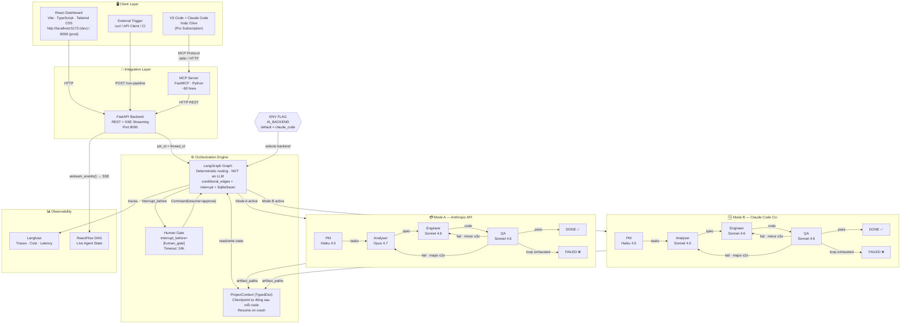
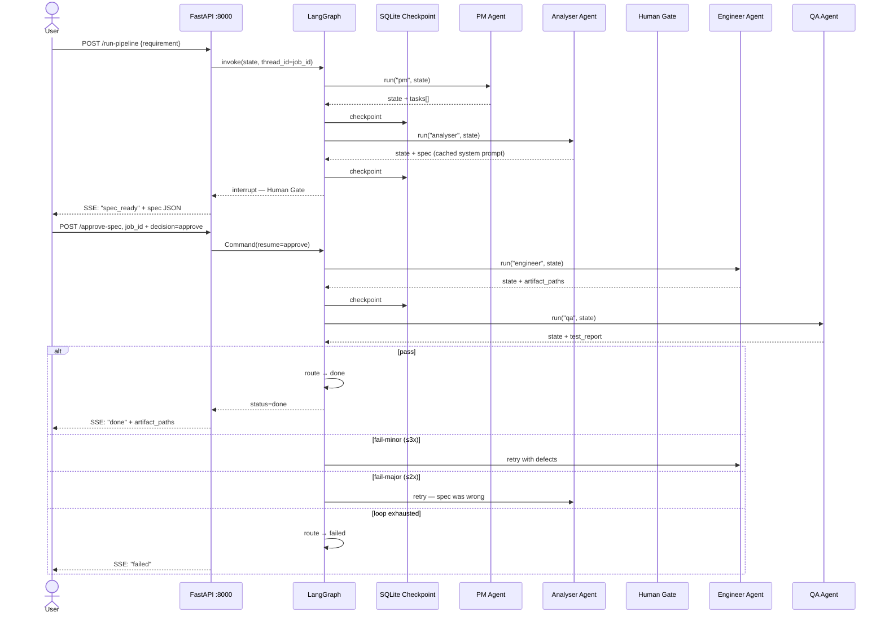
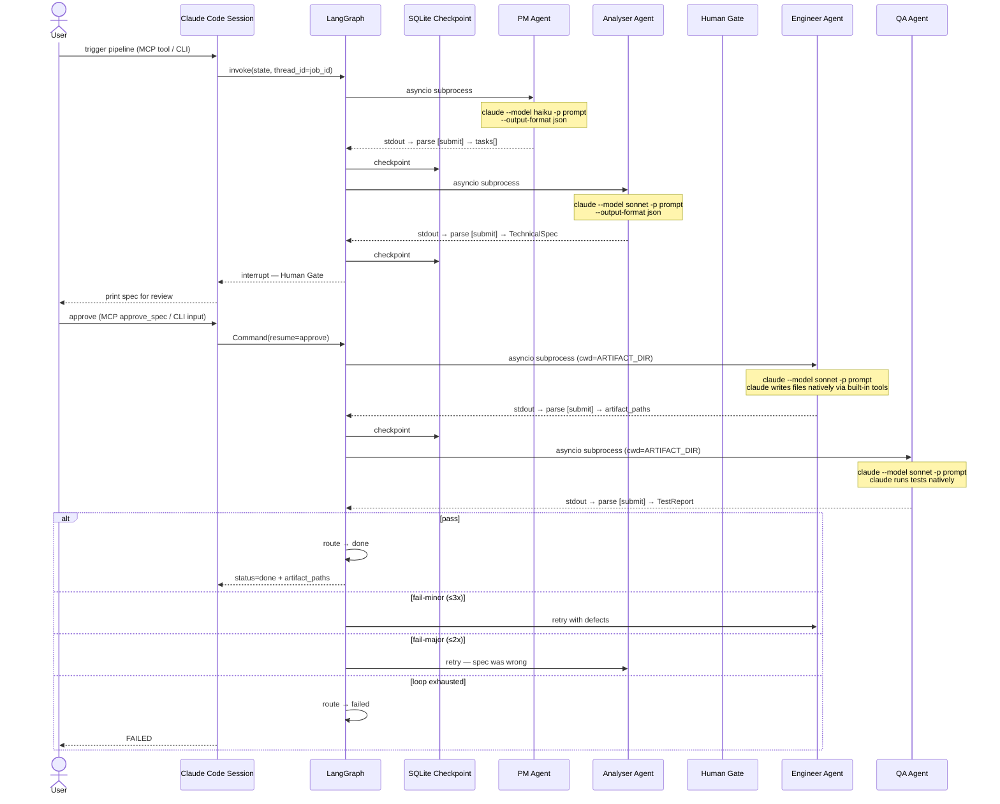

# SOLUTION — AI Orchestrator Architecture

> Tài liệu này tổng hợp các quyết định kiến trúc đã được chốt cho hệ thống AI Orchestrator.
> Mục đích: dùng để trình bày, onboard team, và làm reference khi implement.
> Cập nhật: 2026-05-09 | Thêm: Sequence diagrams Mode A & B

---

## System Architecture Map



---

## 1. Tổng quan hệ thống

| Thành phần | Mô tả |
|---|---|
| **Tên hệ thống** | AI Orchestrator |
| **Mục tiêu** | Tự động hóa quy trình phát triển phần mềm qua 4 AI agents chuyên biệt |
| **Pattern kiến trúc** | LangGraph (deterministic graph, routing KHÔNG phải LLM) |
| **Tích hợp IDE** | MCP Server Bridge → VS Code (Claude Code hoặc Cline) |
| **UI** | React 18 + Vite + TypeScript + Tailwind CSS — sidebar layout, SSE real-time timeline, spec review, QA report |
| **Ngôn ngữ** | Python (backend + MCP) · TypeScript/React (frontend) |
| **Methodology** | SDD — Specification-Driven Development |

### Definition of Done — KPIs

| Metric | Target |
|---|---|
| QA pass rate lần đầu (first-pass) | ≥ 60% |
| Latency full pipeline run | < 5 phút (Mode A, project nhỏ) |
| Cost per run (Mode A) | < $0.20 với caching |
| Resume thành công sau crash | 100% — checkpoint sau mỗi node |
| Human Gate response time | Tối đa 24h trước khi auto-expire |

---

## 2. Pipeline Flow — Theo Từng Mode

### Mode A — Anthropic API (Pay-per-token)

> Chạy fully automated, không cần session mở. Dùng cho production / CI-CD.



**Sequence Table — Mode A**

| # | Actor | Action | Model | Input | Output |
|---|---|---|---|---|---|
| 1 | User | POST /run-pipeline | — | Requirement text | job_id |
| 2 | FastAPI | invoke LangGraph | — | state{request, job_id} | stream |
| 3 | PM Agent | API call | Haiku 4.5 | Requirement + submit instruction | tasks[] |
| 4 | LangGraph | checkpoint | — | state + tasks | SQLite row |
| 5 | Analyser Agent | API call (cached) | Opus 4.7 | Tasks + submit instruction | TechnicalSpec |
| 6 | LangGraph | checkpoint + interrupt | — | state + spec | pause at human_gate |
| 7 | FastAPI | SSE notify | — | spec JSON | "spec_ready" event |
| 8 | User | POST /approve_spec | — | job_id + "approve" | — |
| 9 | Engineer Agent | API call | Sonnet 4.6 | Spec + tasks + submit instruction | artifact_paths + files on disk |
| 10 | LangGraph | checkpoint | — | state + artifact_paths | SQLite row |
| 11 | QA Agent | API call | Sonnet 4.6 | Spec + artifact_paths + submit instruction | TestReport |
| 12 | route_qa | Python function | — | test_report.status | "done" / "engineer" / "analyser" / "failed" |
| 13 | FastAPI | SSE notify | — | final status | "done" hoặc "failed" |

---

### Mode B — Claude Code (Pro subscription, no API key)

> Cần Claude Code session mở. Dùng cho dev / prototype. Mọi agent dùng Sonnet 4.6 (Opus không có).



**Sequence Table — Mode B**

| # | Actor | Action | Model | Input | Output |
|---|---|---|---|---|---|
| 1 | User | trigger via MCP / CLI | — | Requirement text | job_id |
| 2 | LangGraph | invoke | — | state{request, job_id} | start graph |
| 3 | ClaudeCodeBackend | `claude -p` subprocess | Haiku 4.5 | Full prompt + submit instruction | stdout JSON envelope |
| 4 | parse_submit | regex `<submit>` | — | stdout text | tasks[] |
| 5 | LangGraph | checkpoint | — | state + tasks | SQLite row |
| 6 | ClaudeCodeBackend | `claude -p` subprocess | Sonnet 4.6 | Full prompt (tasks + spec instruction) | stdout JSON envelope |
| 7 | parse_submit | regex `<submit>` | — | stdout text | TechnicalSpec |
| 8 | LangGraph | checkpoint + interrupt | — | state + spec | pause at human_gate |
| 9 | User | review spec + approve | — | spec text | "approve" |
| 10 | LangGraph | Command(resume) | — | "approve" | resume graph |
| 11 | ClaudeCodeBackend | `claude -p` subprocess (cwd=ARTIFACT_DIR) | Sonnet 4.6 | Full prompt (spec + engineer instruction) | files written to disk + stdout |
| 12 | parse_submit | regex `<submit>` | — | stdout text | artifact_paths |
| 13 | LangGraph | checkpoint | — | state + artifact_paths | SQLite row |
| 14 | ClaudeCodeBackend | `claude -p` subprocess (cwd=ARTIFACT_DIR) | Sonnet 4.6 | Full prompt (spec + artifacts + QA instruction) | test results + stdout |
| 15 | parse_submit | regex `<submit>` | — | stdout text | TestReport |
| 16 | route_qa | Python function | — | test_report.status | "done" / "engineer" / "analyser" / "failed" |

---

**So sánh trực tiếp 2 modes:**

| | Mode A (API) | Mode B (Claude Code) |
|---|---|---|
| **Auth** | `ANTHROPIC_API_KEY` | Pro subscription session |
| **PM model** | Haiku 4.5 | Haiku 4.5 |
| **Analyser model** | Opus 4.7 | Sonnet 4.6 |
| **Engineer model** | Sonnet 4.6 | Sonnet 4.6 |
| **QA model** | Sonnet 4.6 | Sonnet 4.6 |
| **Cost/run** | ~$0.09–0.18 | $0 thêm |
| **Cần session** | Không | Có |
| **File writing** | SDK tool calls | claude CLI built-in |
| **Submit protocol** | Formal tool call | `<submit>` JSON block |
| **Checkpoint** | Sau mỗi API call | Sau mỗi subprocess |
| **Background** | Có | Không |

---

## 3. Các Agent trong hệ thống

| Agent | Vai trò | Input | Output | Model (Mode A) |
|---|---|---|---|---|
| **PM** | Phân tích yêu cầu, tạo task list có độ ưu tiên | User requirement | Structured task list | Haiku 4.5 |
| **Senior Analyser** | Viết technical spec, data/API contracts, risk analysis | Task list | TechnicalSpec (SDD format) | Opus 4.7 |
| **Senior Engineer** | Implement code theo spec | TechnicalSpec + Tasks | Code files (lưu vào ARTIFACT_DIR) | Sonnet 4.6 |
| **Senior QA** | Validate code theo spec, run tests, báo cáo defects | Artifact paths + Spec | TestReport (pass/fail-minor/fail-major) | Sonnet 4.6 |

### Luồng Pipeline

```
User Requirement
      ↓
[PM Agent]           → tạo danh sách tasks có độ ưu tiên
      ↓
[Analyser Agent]     → viết technical spec theo SDD format
      ↓
[Human Gate]         ← bạn review và approve spec (timeout: 24h)
      ↓
[Engineer Agent]     → implement code, lưu vào ARTIFACT_DIR
      ↓
[QA Agent]           → chạy tests, validate theo spec
      ↓
  PASS                → DONE ✅
  FAIL (minor, ≤3x)   → quay lại Engineer
  FAIL (major, ≤2x)   → quay lại Analyser
  Loop exhausted      → FAILED ❌ (không silent-succeed)
```

> **Tại sao có FAILED state riêng?** Nếu dùng `END` khi hết iteration, system kết thúc nhưng không phân biệt được "thành công" hay "thất bại". FAILED state được surface rõ ở API response, UI, và Langfuse trace.

---

## 3. Dual-Mode Strategy

Hệ thống hỗ trợ 2 modes, chuyển đổi bằng một ENV variable — không cần thay code.

| | **Mode A (Default — MVP)** | **Mode B (Phase 2+)** |
|---|---|---|
| **ENV** | `AI_BACKEND=api` | `AI_BACKEND=claude_code` |
| **LLM Brain** | Anthropic API direct calls | Claude Code sub-agents (Agent SDK) |
| **Chi phí LLM** | ~$0.09–0.18/pipeline run | $0 thêm — covered bởi Pro subscription |
| **Cần API credit** | Có | Không |
| **Chạy 24/7 background** | Có — fully automated | Không — cần Claude Code session mở |
| **Trigger từ ngoài** | Có — POST /run-pipeline | Không (session-based) |
| **Phù hợp** | MVP · Production · CI/CD · Enterprise | Dev cá nhân · tiết kiệm cost |
| **Tương thích LangGraph** | Đầy đủ — `invoke()` trả về state | Cần adapter layer |

> **MVP path:** Ship Mode A trước — fully automated, testable, CI/CD-ready. Mode B là cost optimization, thêm vào Phase 2 sau khi Mode A ổn định. Mode B cần adapter layer để Claude Code sub-agent fit vào LangGraph `invoke()` interface.
>
> **Cách switch:** Chỉ cần đổi `AI_BACKEND` trong file `.env`, restart service. Toàn bộ LangGraph graph, MCP Server, UI không thay đổi.

---

## 4. Technology Stack

### Backend

| Layer | Công nghệ | Lý do chọn |
|---|---|---|
| **Runtime** | Python 3.11+ | Async support, AI/ML ecosystem |
| **API Framework** | FastAPI | Async native, auto OpenAPI docs, SSE support |
| **Orchestration** | **LangGraph** | Built-in interrupt/checkpoint/resume, deterministic routing |
| **Agent Framework** | Anthropic Agent SDK | Native Claude, MCP native, sub-agents |
| **MCP Server** | FastMCP (Python) | ~60 dòng code, auto Pydantic schema |
| **Checkpoint (dev)** | `SqliteSaver` | Zero setup, built into LangGraph |
| **Checkpoint (prod)** | `PostgresSaver` | Concurrent jobs, durability — package: `langgraph-checkpoint-postgres` |
| **Artifact Storage** | Local filesystem (dev) → S3 (prod) | Không embed content trong checkpoint |
| **Observability** | Langfuse (open-source, self-hosted) | Traces, cost, latency per agent |

### Frontend

| Layer | Công nghệ | Lý do chọn |
|---|---|---|
| **Framework** | React + TypeScript | Ecosystem, type safety |
| **DAG Visualization** | ReactFlow | MIT, 148k stars, custom nodes |
| **Real-time** | SSE consumer (EventSource API) | Stream LangGraph events live |
| **Styling** | Tailwind CSS | Rapid UI development |
| **State Management** | Zustand | Lightweight, phù hợp agent state |
| **Monitoring Dashboard** | Langfuse UI (self-hosted) | Embedded hoặc link out |

### Models (Mode A — Anthropic API)

| Agent | Model | Lý do |
|---|---|---|
| PM | `claude-haiku-4-5-20251001` | Task đơn giản, chi phí thấp nhất |
| Analyser | `claude-opus-4-7` | Cần reasoning sâu nhất, spec phức tạp |
| Engineer | `claude-sonnet-4-6` | Balance giữa quality và cost |
| QA | `claude-sonnet-4-6` | Balance — validation không cần Opus |

---

## 5. MCP Server — VS Code Integration

MCP Server là cầu nối để VS Code (Claude Code hoặc Cline) tương tác với Orchestrator backend.

| Primitive | Tên | Mô tả |
|---|---|---|
| **Tool** | `run_pipeline` | Trigger pipeline — trả về `job_id` |
| **Tool** | `get_job_status` | Lấy trạng thái hiện tại của job |
| **Tool** | `approve_spec` | Approve/reject spec tại Human Gate (resume LangGraph) |
| **Tool** | `cancel_job` | Hủy một pipeline đang chạy |
| **Resource** | `project_spec/{job_id}` | Đọc TechnicalSpec của job |
| **Resource** | `test_report/{job_id}` | Đọc kết quả QA |
| **Resource** | `agent_logs/{job_id}` | Đọc log chi tiết từng agent |
| **Prompt** | `/build-feature` | Template: "Build feature X with spec Y" |
| **Prompt** | `/review-spec` | Template: "Review spec trước khi approve" |
| **Prompt** | `/run-qa` | Template: "Chạy QA cho artifacts hiện tại" |

> **job_id = thread_id:** `run_pipeline` tạo ra `job_id` (UUID), pass làm `thread_id` vào LangGraph config. Mọi API call sau đó (`get_job_status`, `approve_spec`) đều dùng `job_id` này để lookup đúng checkpoint.

> **Client support:** Cả **Claude Code** (Anthropic) và **Cline** (open-source, 61k stars) đều support MCP native.

---

## 6. Frontend UI — State Tracking Dashboard

### Layout dashboard

```
┌─────────────────────────────────────────────────────────────┐
│  Job: "Build REST API for auth"          Status: ENGINEERING │
│  Run #3   Started: 14:32   Cost: $0.09  Iteration: 1/3      │
├──────────────────────────┬──────────────────────────────────┤
│                          │                                  │
│   Pipeline DAG           │   Live Agent Log                │
│   (ReactFlow)            │   (SSE Stream)                  │
│                          │                                  │
│  [PM ✅] → [Analyser ✅] │  > Engineer: Reading spec...    │
│    → [Engineer 🔄]       │  > Writing auth/models.py       │
│    → [QA ⏳]             │  > Writing auth/routes.py       │
│                          │  > Running tests...             │
├──────────────────────────┴──────────────────────────────────┤
│  Human Gate: Spec ready for review    [Approve] [Reject]    │
│  Auto-expire in: 23h 42m                                    │
├─────────────────────────────────────────────────────────────┤
│  Token Usage: PM 1.2k | Analyser 8.4k | Engineer 14.1k     │
│  Cost: $0.00  |  $0.06  |  $0.04  |  Total: ~$0.10         │
└─────────────────────────────────────────────────────────────┘
```

### Tại sao không dùng Langflow/Flowise?

| | Langflow / Flowise | Custom React + ReactFlow |
|---|---|---|
| **Setup time** | Nhanh hơn | Lâu hơn |
| **Customize** | Hạn chế (opinionated platform) | Full control |
| **Tích hợp LangGraph** | Partial — platform có graph riêng | Seamless — consume SSE trực tiếp |
| **Production** | Tốt nếu dùng platform đó | Tốt hơn cho custom backend |
| **Quyết định** | ❌ | ✅ **Chọn cái này** |

---

## 7. Ecosystem Tools

### SDD — Specification-Driven Development

| | |
|---|---|
| **Là gì** | Methodology: spec là artifact chính, code là output từ spec |
| **Áp dụng** | Analyser viết spec → Engineer code theo spec → QA validate theo spec |
| **Tool hỗ trợ** | GitHub Spec Kit (93k stars), Kiro (AWS IDE) |
| **Lợi ích** | QA có tiêu chí rõ ràng, không phụ thuộc LLM "đoán" kết quả |

### Cline vs Claude Code

| | **Claude Code** | **Cline** |
|---|---|---|
| **Nhà phát triển** | Anthropic (chính thức) | Community open-source |
| **Chi phí** | Pro subscription | Free (Apache 2.0) |
| **LLM** | Claude only | 30+ providers |
| **MCP** | ✅ Native | ✅ Native |
| **Quyết định** | Primary client | Alternative nếu muốn open-source |

### Paperclip

| | |
|---|---|
| **Là gì** | Framework orchestrate AI agents như một "tổ chức" (org chart, budget, heartbeat) |
| **Stars** | 63,700+ (ra mắt 3/2026) |
| **Stack** | Node.js + TypeScript + React |
| **Heartbeat Pattern** | Agents "ngủ/thức" theo schedule, nhận context mới mỗi lần thức |
| **Quyết định** | Theo dõi — không dùng (Node.js, Python stack không match) |

---

## 8. Giới hạn & Rủi ro

| Rủi ro | Mức độ | Giải pháp |
|---|---|---|
| QA→Engineer loop vô tận | Cao | `MAX_QA_ITERATIONS=3` hard cap → FAILED state |
| QA→Analyser loop vô tận | Cao | `MAX_QA_ANALYSER_ITERATIONS=2` hard cap → FAILED state |
| Human Gate không có người approve | Cao | Auto-expire sau `HUMAN_GATE_TIMEOUT_HOURS=24`, job → FAILED |
| Prompt injection qua MCP | Cao | Sanitize input, whitelist actions trước khi forward |
| Silent failure (hết iteration nhưng báo DONE) | Cao | FAILED terminal state riêng, không dùng END |
| Cost vượt ngân sách (Mode A) | Trung bình | Token budget per agent, alert khi vượt ngưỡng |
| Agent timeout / crash giữa chừng | Trung bình | LangGraph tự checkpoint sau mỗi node — resume tự động |
| Artifact quá lớn làm bloat checkpoint | Trung bình | Lưu file vào `ARTIFACT_DIR`, chỉ store path trong state |
| SQLite không support concurrent jobs | Trung bình | Swap sang `PostgresSaver` khi lên production |
| Mode B throttle (Pro subscription limit) | Thấp | Monitor usage, switch sang Mode A |
| Concurrent jobs dùng chung thread_id | Thấp | Luôn generate UUID cho mỗi job, pass làm `thread_id` |

---

## 9. Phân tích Chi phí

### Mode A (Anthropic API) — MVP & Production

```
Ước tính chi phí 1 pipeline run:
  PM        (Haiku 4.5):  ~2K tokens  → ~$0.001
  Analyser  (Opus 4.7):   ~8K tokens  → ~$0.120
  Engineer  (Sonnet 4.6): ~15K tokens → ~$0.045
  QA        (Sonnet 4.6): ~5K tokens  → ~$0.015
  ─────────────────────────────────────────────
  Tổng:                   ~30K tokens → ~$0.18/run

Với prompt caching (system prompt + spec cached):
  Tiết kiệm ~60-70% phần Analyser → ~$0.09-0.12/run

Ước tính tháng (50 runs): ~$5-9/tháng
```

### Mode B (Claude Code Pro) — Cost Optimization (Phase 2+)

```
Chi phí: $20/tháng flat
Phù hợp: Dev cá nhân, prototype
Giới hạn: Cần session mở, không chạy background 24/7
          Cần adapter layer để fit LangGraph invoke() interface
```

### Artifact Storage

```
Dev:  Local filesystem (ARTIFACT_DIR=./artifacts) — free
Prod: S3 Standard — ~$0.023/GB/tháng
      Với project ~500KB code: < $0.001/run
```

---

## 10. Roadmap Implementation

### MVP — Mode A (Tuần 1–8)

| Phase | Thời gian | Nội dung | Milestone |
|---|---|---|---|
| **Phase 1 — Foundation** | Tuần 1–2 | ProjectContext TypedDict + LangGraph graph + BaseAgent + Mock agents | Pipeline chạy end-to-end với mock, checkpoint/resume hoạt động |
| **Phase 2 — PM + API** | Tuần 3–4 | PM Agent thật + FastAPI backend + SSE streaming | Trigger từ API, xem log real-time, Human Gate endpoint |
| **Phase 3 — Full Pipeline** | Tuần 5–6 | Analyser + Engineer + QA agents | 4 agents chạy hoàn chỉnh, QA feedback loop, FAILED state |
| **Phase 4 — MCP + IDE** | Tuần 7–8 | MCP Server + VS Code integration | Trigger từ VS Code chat, approve spec từ IDE |

### Enhancement (Tuần 9–14)

| Phase | Thời gian | Nội dung | Milestone |
|---|---|---|---|
| **Phase 5 — UI** | Tuần 9–10 | React Dashboard + ReactFlow DAG + Langfuse | Full state tracking, cost dashboard |
| **Phase 6 — Mode B** | Tuần 11–12 | Claude Code sub-agent adapter + LangGraph bridge | Mode B hoạt động, switch bằng ENV |
| **Phase 7 — Production** | Tuần 13–14 | Docker + PostgresSaver + auth + rate limiting + S3 | Enterprise-ready deployment |

### Build Order (phải theo thứ tự — mỗi bước validate bước trước)

```
1.  ProjectContext TypedDict (LangGraph state schema) + Task/Spec/TestReport models
2.  BaseAgent interface — Mode A skeleton (invoke, system_prompt, tools)
3.  LangGraph graph — nodes, human_gate (interrupt), route_qa, FAILED state, compile
4.  PM Agent (đơn giản nhất — validate toàn bộ graph chạy được)
5.  FastAPI backend + SSE endpoint (stream LangGraph astream_events)
6.  Human Gate UI + approve endpoint (resume Command)
7.  MCP Server (FastMCP — expose tools/resources/prompts)
8.  Analyser → Engineer → QA agents (theo thứ tự, validate từng agent)
9.  Langfuse integration (callback handler vào LangGraph)
10. React Dashboard (ReactFlow DAG + SSE consumer + cost display)
11. PostgresSaver swap (dev→prod checkpoint migration)
12. Mode B adapter layer (Claude Code sub-agent → LangGraph invoke interface)
```
